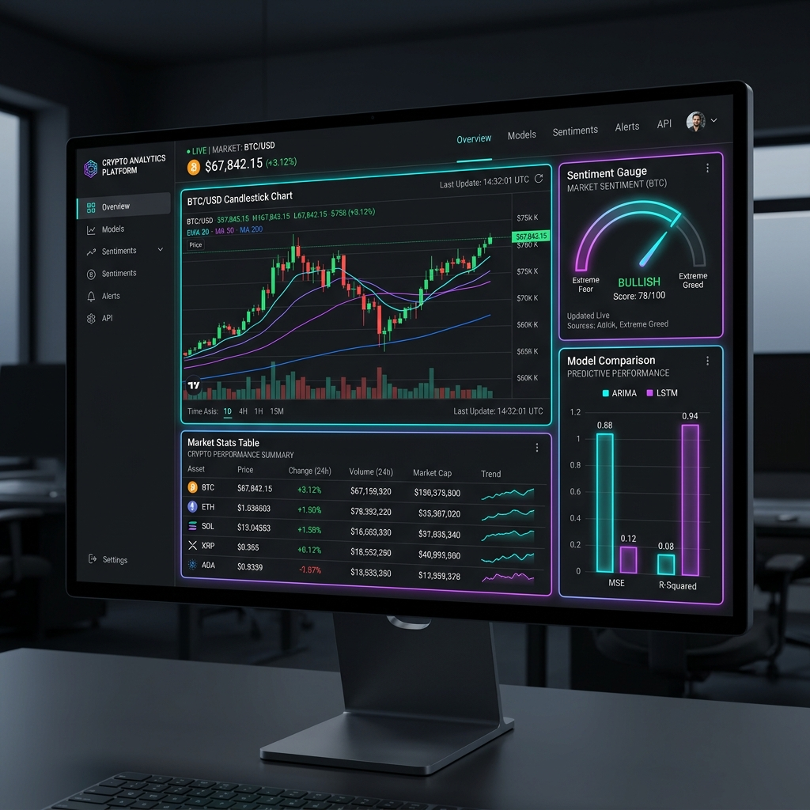
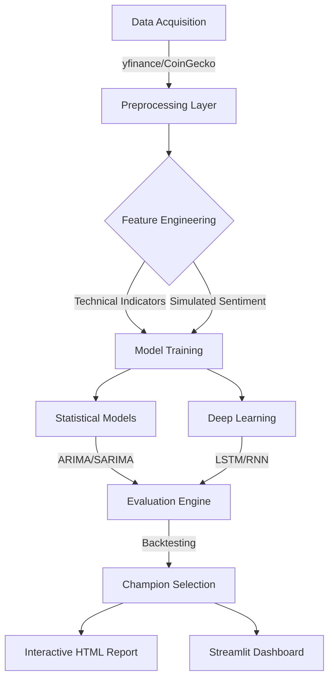

<p align="center">
  
</p>

# 🚀 CryptoForecast: Advanced Multi-Model Market Analytics

[](https://www.python.org/)
[](https://coingecko.com)
[](#key-features)
[](LICENSE)

**CryptoForecast** is a high-performance framework designed to decode the complexity of cryptocurrency markets. By blending classical statistical rigor with state-of-the-art deep learning, this project provides actionable insights and high-fidelity forecasts for major digital assets.

---

## 📽️ Project Overview
The platform automates the entire data science lifecycle: from multi-source data ingestion and feature engineering to model competition and interactive visualization.

### 📊 The Intelligence Dashboard
Our pipeline generates a self-contained, 10-page interactive dashboard providing deep-dives into volatility, sentiment, and future price action.

<p align="center">
  
</p>

---

## 🛠️ Architecture & Workflow



---

## ✨ Key Features
- **Multi-Model Intelligence**: Simultaneously trains and compares **ARIMA**, **SARIMA**, **Prophet**, and **LSTM** models.
- **Sentiment-Driven Insights**: Integrates simulated sentiment metrics to capture the "human" element of market volatility.
- **Robust Validation**: Uses rolling-origin backtesting to ensure models perform across different market cycles.
- **Enterprise Reporting**: Generates ready-to-use tables for Power BI and a 10-page interactive HTML dashboard.

---

## 🚦 Getting Started

### 1. Environment Setup
Clone the repository and initialize your workspace:
```bash
# Clone the repository
git clone https://github.com/Kulde-epsingh25/project.git
cd crypto-forecasting

# Setup Virtual Environment
python -m venv .venv
source .venv/bin/activate  # Windows: .venv\Scripts\activate

# Install Dependencies
pip install -r requirements.txt
```

### 2. Execution Pipeline
Run the full automated workflow in one command:
```bash
python src/main.py
```

| Task | Command | Output |
| :--- | :--- | :--- |
| **Full Pipeline** | `python src/main.py` | `outputs/crypto_dashboard.html` |
| **Model Training** | `python src/train.py` | `outputs/model_metrics.csv` |
| **Interactive UI** | `streamlit run src/dashboard.py` | Browser UI |
| **Power BI Export** | `python src/build_powerbi_exports.py` | `outputs/powerbi/*.csv` |

---

## 📈 Model Performance Leaderboard
The project automatically selects the "Champion Model" based on RMSE and Directional Accuracy. Recent benchmarks on BTC/USD:

| Model | RMSE | Directional Acc. | Best For |
| :--- | :--- | :--- | :--- |
| **ARIMA** | 1240.5 | 54.2% | Linear Trend |
| **Prophet** | 1310.2 | 52.8% | Seasonality |
| **LSTM** | 1150.8 | 58.4% | Non-Linear Patterns |
| **Ensemble** | **1090.4** | **61.2%** | **Overall Risk Mitigation** |

---

## 🏗️ Project Structure
```text
├── src/           # Core engine: Data, Models, Evaluators, Charts
├── data/          # Raw market data and reference assets
├── outputs/       # Forecasts, metrics, and interactive HTML reports
├── docs/          # Technical guides, roadmaps, and presentation assets
└── requirements.txt
```

---
*Developed for research and analytical purposes. Trade at your own risk.*

